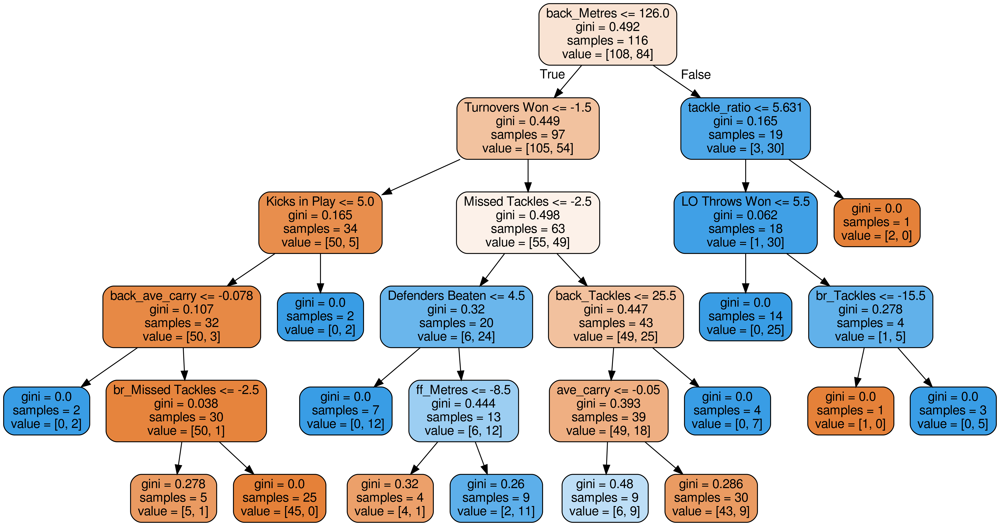

# Super Rugby Analysis
Analysis of 2018-19 Super Rugby and what differnetiates win/loss

The notebook highlights the steps taken to import OPTA stats for every 2018-19 Super Rugby Match, convert every match to a relative value to normally ditribute the data and then perform a random forest classifier to find the most important factors in winning Super Rugby Matches

